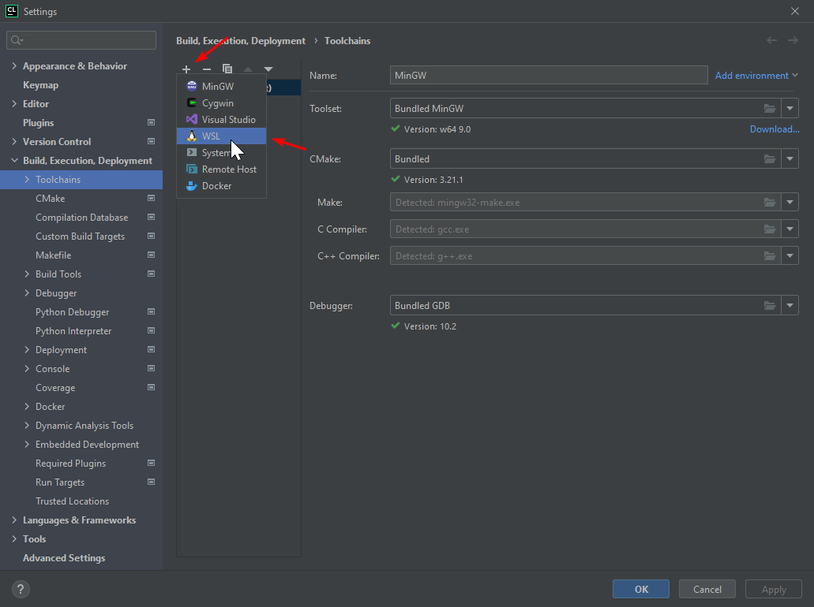
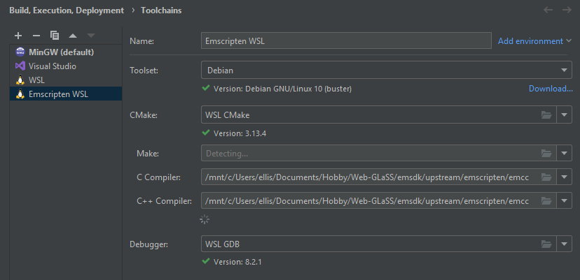
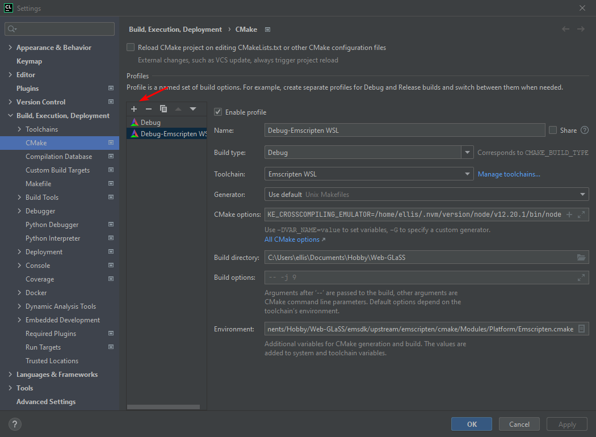
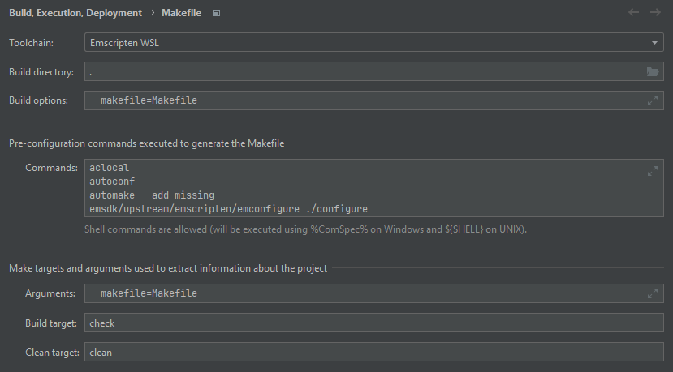

[Home](../README.md)

# Setting up CLion

These steps set up CLion to build the engine along with the test game, by clicking the build icon.

Toolchains are global, however the modified CMake and Makefile configs are per make project, which is very handy :) 

To export the engine for distribution, it's still required to run `bin/export.sh`
meet
Assuming:
- using WSL on Windows 10.
- Node >12 is installed somewhere

0. Run `bin/install/install.sh`
1. [Create a new emscripten toolchain](#Create-a-new-emscripten-toolchain)
2. [Create a new CMake profile](#Create-a-new-CMake-profile)
3. [Configure Makefile](#Configure-Makefile)

## Create a new emscripten toolchain

1. Go to settings > build, execution, deployment > toolchains
2. Click + or press alt+insert
3. Click WSL
4. Name it "Emscripten WSL" or "Something sensible" 



5. Set toolset to your WSL distribution
6. Set CMake to WSL CMake
7. Set C and C++ compiler paths to "/{path to project}/Web-GLaSS/emsdk/upstream/emscripten/emcc"
8. Set Debugger to WSL GDB



## Create a new CMake profile

1. Go to settings > build, execution, deployment > CMake
2. Click + or press alt+insert
3. Name it "Sensibly", or don't, you could name it something weird like "Debug-Emscripten WSL" like a NERD
4. Set build type to Debug, I'm not sure what this does, but it's definitely something
5. Set the toolchain to the one you just made
6. Set CMake options to "-DCMAKE_CROSSCOMPILING_EMULATOR={path/to/node/executable}"
7. Set build directory to the root of the project directory
8. Set environment to "CMAKE_TOOLCHAIN_FILE=/{path to project}/Web-GLaSS/emsdk/upstream/emscripten/cmake/Modules/Platform/Emscripten.cmake"



## Configure Makefile

1. Go to settings > build, execution, deployment > Makefile
2. Set toolchain to Emscripten WSL
3. Set build directory to "."
4. Set build-options to "--makefile=Makefile" < I don't know if this is important, but it doesn't (?) hurt
5. Set pre-configuration commands to
```bash
aclocal
autoconf
automake --add-missing
emsdk/upstream/emscripten/emconfigure ./configure
```
6. Set arguments to "--makefile=Makefile" ???

